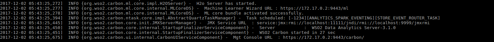

# Dockerfile for WSO2 Data Analytics Server #

The Dockerfile defines the resources and instructions to build the Docker image for WSO2 Data Analytics Server 3.1.0.

## Build and run

 Steps to build the WSO2 Data Analytics Server 3.1.0 Docker image and run in your local machine.
 
 The local copy of the `Dockerfile` directory will be referred as, `DOCKERFILE_HOME`.
 
 * Add the JDK and WSO2 Data Analytics Server distributions
     - Download JDK 1.8 (http://www.oracle.com/technetwork/java/javase/downloads/jdk8-downloads-2133151.html) and copy it to `<DOCKERFILE_HOME>/files`.
     - Download the WSO2 Data Analytics Server 3.1.0 distribution (https://wso2.com/analytics) and copy it to `<DOCKERFILE_HOME>/files`.
 
 * Build the Docker image
     - Navigate to `<DOCKERFILE_HOME>` directory.
     - Execute the `docker build` command as shown below:
         + `docker build -t wso2das:3.1.0 .`
 
 * Docker run
     - Run the WSO2 Data Analytics Server 3.1.0 Docker container as follows;
         + `docker run -it -p 9443:9443 wso2das:3.1.0`
         
       **Note**: Here, only port 9443 (HTTPS servlet transport) has been mapped to a Docker host port.
       You may map other container service ports, which have been exposed to Docker host ports, as desired.
         
   
 
 * Access management console
     -  To access the management console, use the Docker host IP and port 9443.
         + `https://<DOCKER_HOST_IP>:9443/carbon`

## Modify configurations of the WSO2 Data Analytics Server running in the container
The configurations will be maintained on the Docker Host machine and volume mounted to the container.

As an example, the steps required to change the port offset in `carbon.xml` is detailed.

* Stop the WSO2 Data Analytics Server container if it's already running.

* Create the required config changes in the host machine
    - Extract the `wso2das-3.1.0.zip` file located in `DOCKERFILE_HOME/files`.
        + Navigate to `<DOCKERFILE_HOME>/files` directory
        + `unzip -q wso2das-3.1.0.zip`
    - Change the port offset in `carbon.xml` file located in `DOCKERFILE_HOME/files/wso2das-3.1.0/repository/conf/` directory.
    - Grant write permission to the `DOCKERFILE_HOME/files/wso2das-3.1.0/repository/conf/` directory on the host machine to `other` users;
        + `sudo chmod o+w -R DOCKERFILE_HOME/files/wso2das-3.1.0/repository/conf`

* Run the docker container by mounting the config directory (`DOCKERFILE_HOME/files/wso2das-3.1.0/repository/conf/`) of the host machine.
    - Navigate to `<DOCKERFILE_HOME>` directory.
    - `docker run -it --mount type=bind,source=${PWD}/files/wso2das-3.1.0/repository/conf,target=/home/wso2user/wso2das-3.1.0/repository/conf wso2das:3.1.0`

* If the `conf` directory on the host machine is located on a different directory than shown above, when executing the `docker run`
command the absolute path of the `conf` directory should be set as the `source`.
